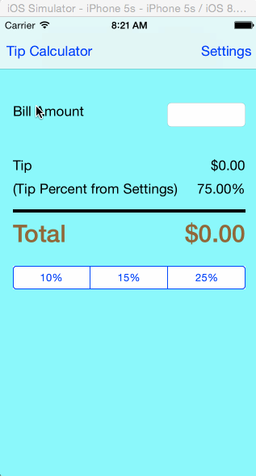

# Tip Calculator Application Using Swift

(For Prework assignment)

This is a tip calculator iOS application developed by following the steps and video given in the prework assignment steps of CodePath.

Time spent: 8 hours spent in total (including training)

Completed user stories:

 * [x] Required: Basic tip calculator app to calculate tip based on selected tip percentage from the Segmented Control
 * [x] Required: Augmented Tip calculator and added settings view, where we can enter default tip percentage. Modal Transition is used here. 
 * [x] Optional: Background Colors have been changed
 
Notes:

* This application shows how we calculate tip as and when we type the bill amount.
* There are 3 configured tip percentages 10, 15 and 25.
* Based on the amount entered and tip percentage selected from the Segmented control, the tip amount and total amount are calculated.
* Keyboard is dismissed on clicking outside by using Tap Gesture Recognizer
* Have also implemented a new view called Settings and we can enter some default tip percentage in that. On clicking the save button, it gets back to original screen and shows the defaultTipPercentage. Modal Transition is used here to show and dismiss the settings view. For the first time, if tip percentage is not selected from the segmented control, default tip percentage set in the settings view is used to calculate the tip

We have used the following UI components :

* TextField
* UILabel
* Tap Gesture Recognizer
* View
* Segmented Control
* UIViewController

Walkthrough of all user stories:

GIF created with [LiceCap](http://www.cockos.com/licecap/).